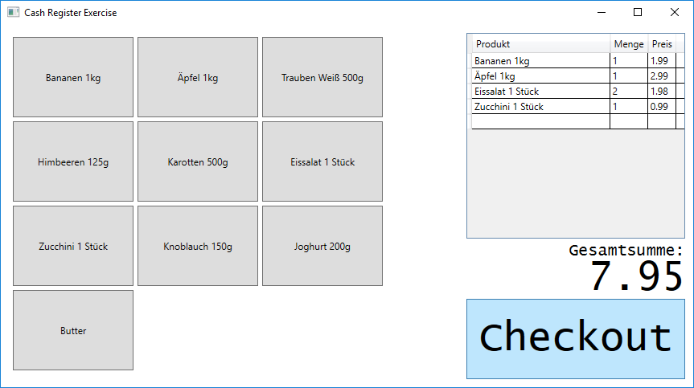

# WPF Cash Register Sample

## Introduction

In this exercise, you create a simple cash register. The final result should be a user interface that looks like this:

* If the user clicks on a product, add it as a receipt line.
* If the clicked product is already in the receipt, increase the amount of pieces bought.
* The total price of the receipt line and the total price of the receipt should be updated accordingly.
* The entire business logic must be implemented in `MainWindowViewModel`.
* The entire view must be implemented in `MainWindow`.
* When the user clicks _Checkout_, store the entire receipt in the database and clear the receipt.

## Specification

**Important**: In the upcoming exam, you will **not** need to create the EF Core model yourself. You will get the model classes and the data context class. You will have to implement the Avalonia UI.

* Create a SQLite database with Entity Framework Core
* Create a frontend with Avalonia that uses the database.
* The database should store products. Every product consists of:
  * ID (numeric, unique key)
  * Product name (mandatory)
  * Unit price (numeric, mandatory)
* The database should store receipt lines. Every receipt line consists of:
  * ID (numeric, unique key)
  * Reference to the bought product
  * Amount of pieces bought
  * Total price (numeric, amount * product's unit price)
* The database should store receipts. Every receipt consists of:
  * ID (numeric, unique key)
  * A list of receipt lines (at least one)
  * Total price (numeric, sum of total prices of all receipt lines)
